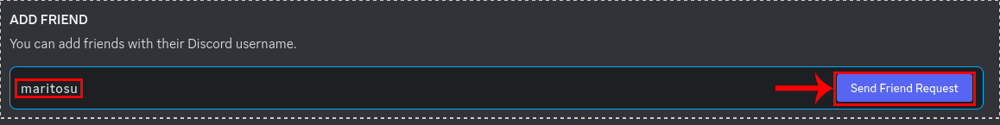
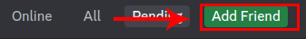
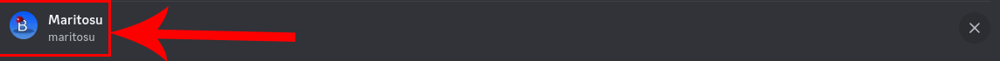
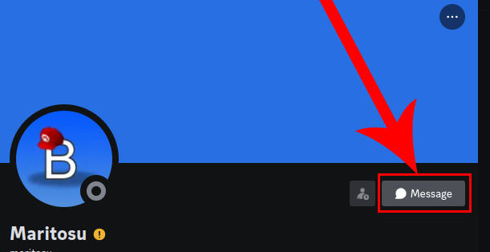

First type maritosu in "ADD FRIEND" section no this is not adding me i do not accept friend requests

Things for CollabVM

# File downloads
https://drive.google.com/drive/folders/1gBfKZlBp7SGz7Hd3G4w1eusi5EwNylNZ

### CTGP-R Wii channel animation remade in Godot Windows 8.1+ x86_64 download
https://mega.nz/file/WDAzGDQQ#Y3a0cLEScDX729D_3-gHgUWPG-3cDhxTCU2TCFrjKiE

### Funni twitch stream key
live_1428356526_uQcbMjGsWiwMQbhzDjElnmO9Y5xNyG

### Bad Piggies Rebooted Windows 8.1+ x86_64 download
https://drive.google.com/file/d/1K0baOUK-4oqyfXjJ809QS-r2cI-ZYFx2/view

Now click the "Add Friend button"

Click my icon or my name

After you open my profile click the "Message" button

And there you go! let me know what you want from me assistance or request to work on something

[Go back](https://github.com/1nhp)
